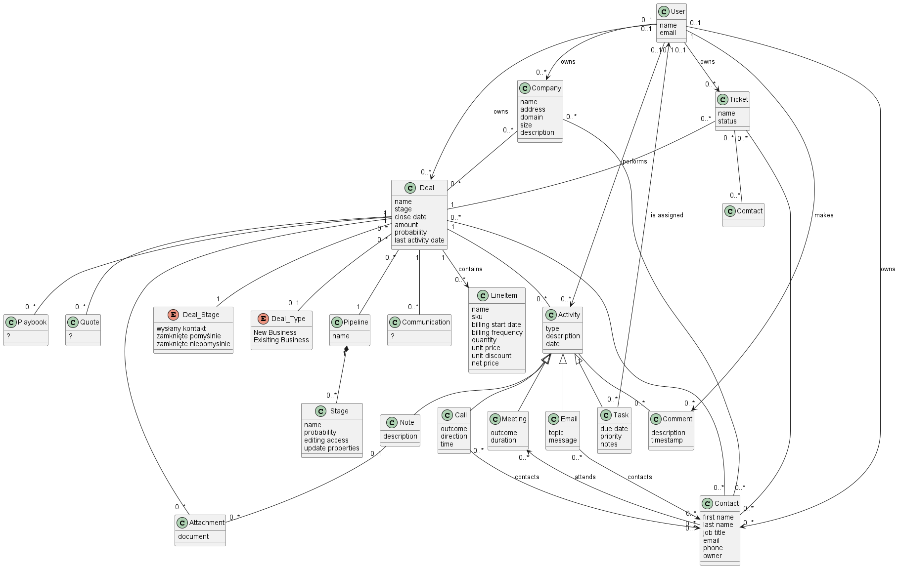

# Conceptual model

[image specification](conceptual_model.puml)

# Functional requirements

## Deal list
### Pagination
1. List of deals must be pagination
2. User must be able to navigate between pages
3. User must be able to select 25, 50 or 100 items per page
### Filtering
Application must allow filtering of deal list:
1. User must be able to filter the deals by:
   - owner
   - creation date
   - last activity date
   - close date
   - via advanced filter: any field defined in Deal datamodel
   
2. User must be able to sort the deals - both ascending and descending - by any column in the tabular view
3. User must be able to set columns he wants to see in tabular view
4. By default new tabular view must contain following columns:
   - deal name
   - deal stage
   - close date
   - deal owner
   - amount
   - associated contacts
   - associated companies
   - deal probability
   - deal type

### Views
1. [User must be able to add views](View_add.md)
2. User must be able to switch between views
3. Filters and sort options should be applied to current view only
4. User must be able use up to 50 views
5. User must be able to save filters and sort options on a view

## Deal board
TBD

## Deal details
TBD

# Nonfunctional requirements
## Interface
1. Color palette used in GUI should be ADA (Americans with Disabilities Act) compliant
2. System should be run in Chrome, Opera and Safari web browsers
3. Interface should follow RWD (Responsive Web Design) practices
4. Interface should allow all operations on device as small as 800x600 px display
## Performance
1. Loading of one page of deal list should take no more than 1 sec
2. Loading deal details shoud take no longer than 1 sec
3. Selection lists of users should be bufferedA
4. Selection lists of contacts should be buffered
5. Selection lists of companies should be buffered
## Security
1. Users can can access only allowed deals
2. Users can access only allowed detail data
3. System should allow enabling 2FA (2 factor authentication)
## Reliability
1. System should use no more than x maintenance windows per month
2. System should be available 85% of time
3. System should be available 90% of time in business hours (9am-5pm GMT)